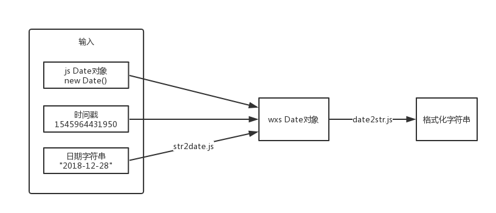

# date

日期格式化函数，用于将日期转换成特定格式的字符串

## 使用

将 `date.wxs`、`str2date.wxs`、`date2str.wxs` 三个文件放入同一个文件夹中，在需要使用的地方引入 `date.wxs` 即可。

```html
<wxs src="./fakepath/date.wxs" module="date" />
<view>当前日期：{{date('YYYY-mm-dd HH:ii:ss EEE')}}</view>
<view>指定日期：{{date('YYYY-mm-dd HH:ii:ss EEE', 1545898539455)}}</view>
```

## API

```js
date(format[, date])
```

### 参数

- `format` 为目标格式字符串，其中的关键词将被替换为时间片段。
- `date` 时间戳、`Date`对象或日期字符串。（可选参数，不传则使用当前时间）

## 原理



## 高级用法

### 自定义关键词

关键词是指目标格式字符串中被替换成日期的特定字符串片段，这些关键词可以在 `date2str.wxs` 文件中指定。

默认支持的关键词有：

- `YYYY` 年份
- `mm`   月份（补全2位）
- `m`    月份
- `dd`   日（补全2位）
- `d`    日
- `HH`   小时（补全2位）
- `H`    小时
- `ii`   分（补全2位）
- `i`    分
- `ss`   秒（补全2位）
- `s`    秒
- `EEE`  星期

### 自定义日期字符串转换规则

当使用日期字符串作为函数的参数时，由于ios对日期字符串的支持较差，因此在 `str2date.wxs` 文件中，导出了一个函数，用于将日期字符串转换为日期对象。可以通过修改这个文件来自定义日期字符串的转换规则。

默认已经对这些形式的字符串进行处理：

- `2018-12`
- `2018-12-28`
- `2018-12-28 14:17`
- `2018-12-28 14:17:17`
- `2018-12-28 14:17:17.2`
- `2018-12-28 14:17:17.23`
- `2018-12-28 14:17:17.233`
- `2018/12`
- `2018/12/28`
- `2018/12/28 14:17`
- `2018/12/28 14:17:17`
- `2018/12/28 14:17:17.2`
- `2018/12/28 14:17:17.23`
- `2018/12/28 14:17:17.233`
